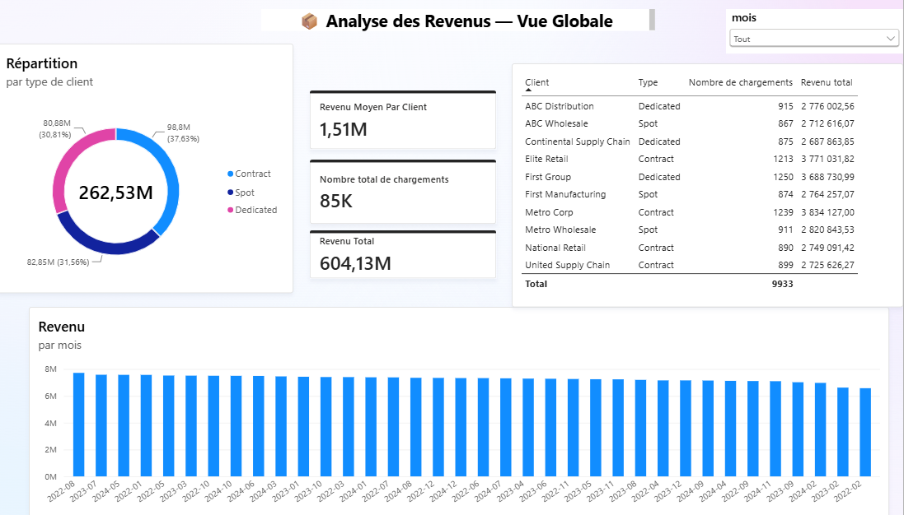
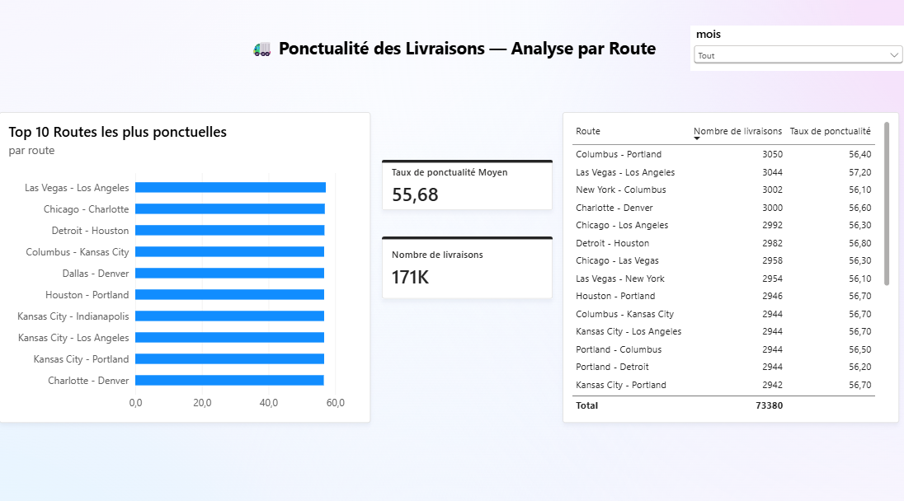
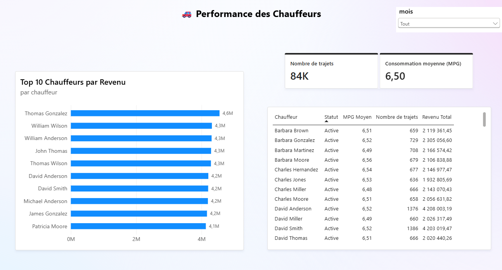
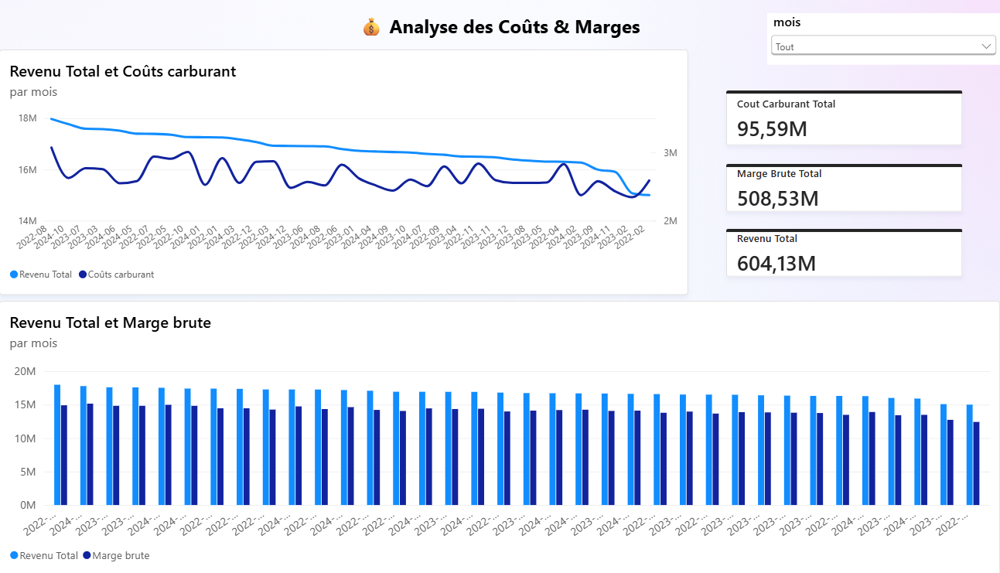

# 🚛 Analyse des Opérations de Transport Routier — SQL & Power BI

> Projet portfolio Data Analyst · Secteur Logistique & Transport · 2025






---

## 🎯 Problématique

**Comment analyser les performances opérationnelles d'une entreprise de transport routier pour identifier les leviers d'optimisation de la rentabilité ?**

---

## 📊 KPIs Clés

| KPI | Valeur |
|-----|--------|
| 💰 Revenu total | 604.13M$ |
| 📈 Marge brute | 508.53M$ |
| ⛽ Coût carburant | 95.59M$ |
| 🚚 Chargements totaux | 85K |
| 👤 Revenu moyen par client | 1.51M$ |
| 🕐 Taux de ponctualité moyen | 55.68% |
| 🛣️ Livraisons analysées | 171K |
| 👷 Trajets chauffeurs | 84K |
| ⛽ Consommation moyenne | 6.50 MPG |

---

## 💡 Insights Clés

- **Thomas Gonzalez génère 4.6M$** — 12% de plus que la moyenne des Top 10 chauffeurs
- **Taux de ponctualité à 55.68%** — moins d'1 livraison sur 2 à l'heure → levier majeur d'amélioration opérationnelle
- **Las Vegas - Los Angeles = route la plus ponctuelle** (57.20%) → à analyser comme benchmark pour les autres routes
- **Coût carburant = 15.8% du revenu total** → optimisation des trajets et du MPG = levier de marge direct
- **Répartition équilibrée** des types de clients : Contract (37.6%), Dedicated (31.6%), Spot (30.8%) → pas de dépendance à un segment

---

## 📊 Dashboard Power BI — 4 pages

| Page | Contenu |
|------|---------|
| 💰 Revenus | Revenu mensuel 3 ans, répartition clients, Top 10 clients |
| 🕐 Ponctualité | Top 10 routes, taux ponctualité, volume livraisons |
| 👷 Chauffeurs | Top 10 par revenu, MPG, tableau détaillé |
| 💹 Coûts & Marges | Revenus vs carburant, marge brute mensuelle |

---

## 🗄️ Base de données SQL

**14 tables · 550 000+ lignes**

| Table | Description |
|-------|-------------|
| `loads` | Chargements avec revenus et statuts |
| `trips` | Trajets avec distance, durée, carburant |
| `delivery_events` | Événements de livraison et ponctualité |
| `drivers` | Chauffeurs et leurs caractéristiques |
| `customers` | Clients et types de contrats |
| `routes` | Routes avec distances et tarifs |
| `fuel_purchases` | Achats carburant par trajet |

---

## 📝 Requêtes SQL clés

```sql
-- Top 10 clients par revenu
SELECT c.customer_name, SUM(l.revenue) as revenu_total
FROM loads l JOIN customers c ON l.customer_id = c.customer_id
GROUP BY c.customer_name ORDER BY revenu_total DESC LIMIT 10;

-- Taux de ponctualité par route
SELECT r.route_name,
  CAST(SUM(CAST(de.on_time_flag AS INTEGER)) AS FLOAT) / COUNT(*) * 100 as taux_ponctualite
FROM delivery_events de
JOIN trips t ON de.trip_id = t.trip_id
JOIN loads l ON t.load_id = l.load_id
JOIN routes r ON l.route_id = r.route_id
GROUP BY r.route_name ORDER BY taux_ponctualite DESC;

-- Marge mensuelle (revenus - coûts carburant)
SELECT strftime('%Y-%m', t.trip_date) as mois,
  SUM(l.revenue) as revenu_total,
  SUM(fp.total_cost) as cout_carburant,
  SUM(l.revenue) - SUM(fp.total_cost) as marge_brute
FROM trips t
JOIN loads l ON t.load_id = l.load_id
JOIN fuel_purchases fp ON t.trip_id = fp.trip_id
GROUP BY mois ORDER BY mois;
```

---

## 📐 Mesures DAX

```dax
Revenu Total = SUM(marge[revenu_total])
Marge Brute Total = SUM(marge[marge_brute])
Taux Marge % = DIVIDE(SUM(marge[marge_brute]), SUM(marge[revenu_total])) * 100
Taux Ponctualite Moyen = AVERAGE(ponctualite[taux_ponctualite])
Revenu Moyen Par Client = AVERAGEX(revenus_client, revenus_client[revenu_total])
```

---

## 🛠️ Stack technique

- **SQL** · SQLite · DBeaver
- **Python** · Pandas · sqlite3 *(import et agrégation)*
- **Power BI Desktop** · DAX *(dashboard interactif)*
- **GitHub** · versioning du projet

---

## 🚀 Lancer le projet en local

```bash
git clone https://github.com/thierrylaguerre/logistics-sql-powerbi
cd logistics-sql-powerbi
pip install -r requirements.txt
python import_db.py
```

Puis ouvrir `dashboard_logistique.pbix` dans Power BI Desktop.

---

## 👤 Auteur

**Thierry Laguerre** · Candidat Data Analyst Junior · Paris Île-de-France

Master Big Data — Paris 8 · Licence Informatique — Sorbonne Paris Nord

[](https://www.linkedin.com/in/thierry-laguerre-ba1267257/)
[](https://github.com/thierrylaguerre)
[](mailto:thierrylaguerre81@gmail.com)
